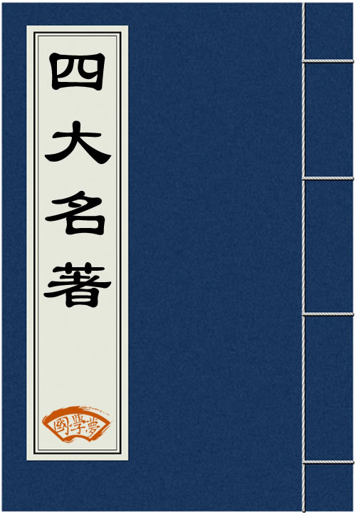

# 四大名著数字展示平台



## 项目简介
这是一个基于HTML+CSS+JavaScript的四大名著静态展示网站，通过现代前端技术展现中国古典文学魅力。本项目曾获2025永创杯网页设计大赛三等奖。

## 技术实现
### 核心技术
- 纯静态架构：无后端服务，仅使用HTML+CSS+JS 
- 交互效果：CSS3动画 + JavaScript事件处理

### 不足之处
1. 性能问题
- 首页加载时间较长
- 未实现图片懒加载

2. 音乐播放系统
- 音乐无法跨页面持续播放
- 页面切换导致播放中断

3. 移动端适配
- 并未完整实现移动端适配
- 部分动画帧率不稳定

4. 功能限制
- 登录/注册仅为前端演示，无实际功能
- 搜索框仅为展示，无实际搜索功能
- 引导系统进度无法跨页面保存
## 版权声明
### 图片资源
- 封面图片：来自公开书籍封面（仅用于展示）
- 其他所有图片：使用豆包AI生成（原创内容）
## 项目结构
```bash
EC-Cup/
├── css/
│   ├── styles.css    
│   ├── guide.css    
│   ├── Sg.css
│   └── ...   
├── html/
│   ├── Index.html     
│   ├── HlmPage.html   
│   ├── MoreBook.html
│   └── ...             
├── js/
│   ├── script.js    
│   ├── Sg.js
│   └── guide.js      
├── img/                
│   ├── HomeImg/
│   │   ├── book.jpg      
│   │   ├── logo.png
│   │   ├── ...
│   ├── 12Character/
│   │   ├── back.png      
│   │   ├── lizhi.png
│   │   └── ... 
│   ├── music.mp3
│   └── ...    
├── SomeShow/  
│   ├── show(1).png
│   ├── show(2).png
│   ├── ...
└── README.md 
```
.png)
.png)
.png)
.png)
.png)
.png)
.png)
>更多可以下载观看